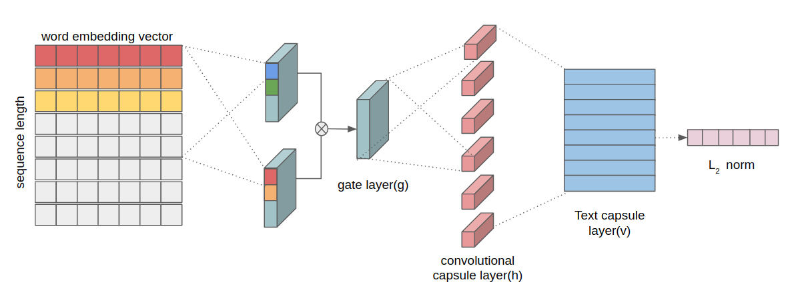
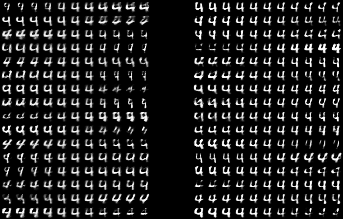

# Capsule Networks for Text Classification

### Text Capsule Network 

Implementation of our paper "**[Text Classification using Capsules][1]**".  

Empirical exploration of the use of capsule networks for text classification.
We applied the model used in image classification as a model of text classification.
We have shown through experimentation that capsule networks have potential for text classification.
While it has been shown that capsule networks are effective for image classification, their validity in the domain of text has not been explored.
In this paper, we show that capsule networks indeed have potential for text classification,
and that they have several advantages over convolutional neural networks.



### Accuracy in paper (Modified)

**Notice** : Qualitative results. The performance of the compared methods differs from the performance based on the paper because it is the result of our dataset measurements.

##### Document

| Model | 20NEWS | REUTERS-10K | MR(2004) | IMDb |
| --- |---|---|---|---|
| CapsNet-Static | 86.78 | 87.52 | 89.0 | 89.72 |
| CapsNet-Dynamic | 86.68 | 86.72 | 88.0 | 89.80 |
| CNN (Kim, 2014) | 86.60 | 87.40 | 88.0 | 90.36 |
| DCNN (kalchbrenner, 2014) | 84.59 | 88.23 | 86.0 | 89.74 |

##### Sentence
| Model | MR(2005) | TREC-QA | MPQA |
| --- |---|---|---|
| CapsNet-Static | 80.98 | 94.80 | 90.10 |
| CapsNet-Dynamic | 81.00 | 94.60 | 90.01 |
| CNN (Kim, 2014) | 81.3 | 92.7 | 89.9 |
| DCNN (kalchbrenner, 2014) | 82.38 | 91.20 | 89.63 |


## Dataset
You can download dataset [here][2], and unzip in directory.  
If you unzip folder to specific folder name, you can change base-directory at **'code/config.py'**

Each dataset consist of **Data frame, GloVe word vector, Vocab, Word idx** and additional features

## Requirements

Our experiment setting as follow:  
Tensorflow version : 1.13.1  
Keras version : 2.2.4  
Scikit-learn : 0.21.1

```bash
pip install -r requirements.txt
```

## Run

```bash
python code/train.py -dataset <dataset>
```

## Experiment

### Properties of Capsule for Static Routing

|  | 
|:---:| 
| *Quantitative result of digit 8. **(Left)** Reconstructed result of digit 8 for static routing. **(Right)** Reconstructed result of digit 8 for dynamic routing.* |


|  | 
|:---:| 
| *Quantitative result of digit 4. **(Left)** Reconstructed result of digit 4 for static routing. **(Right)** Reconstructed result of digit 4 for dynamic routing.* |


[1]:https://arxiv.org/abs/1808.03976
[2]:https://drive.google.com/open?id=13eTBkxwdgjrFiUjXlZbYqlclqjpd0Eqk
